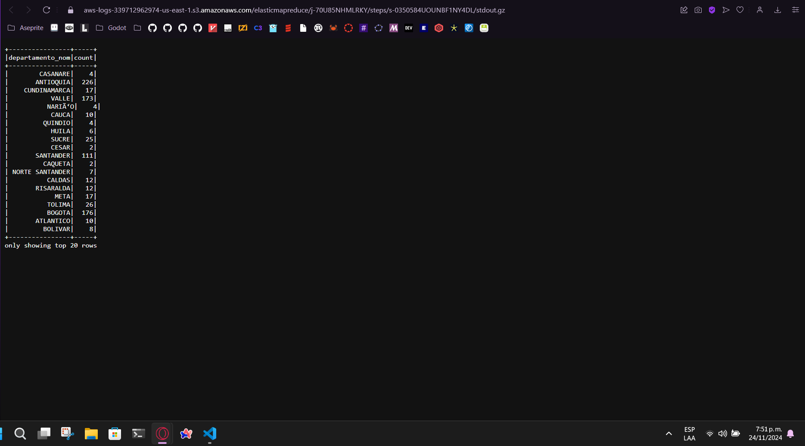

# info de la materia: ST0263-242
#
# Estudiante(s): Miguel Cock, Jonathan Betancur, Esteban Vergara 
#
# Profesor: nombre, email-eafit

# nombre del proyecto, lab o actividad
#
# 1. breve descripción de la actividad
#
## 1.1. Que aspectos cumplió o desarrolló de la actividad propuesta por el profesor (requerimientos funcionales y no funcionales)

## 1.2. Que aspectos NO cumplió o desarrolló de la actividad propuesta por el profesor (requerimientos funcionales y no funcionales)

# 2. información general de diseño de alto nivel, arquitectura, patrones, mejores prácticas utilizadas.

# 3. Descripción del ambiente de desarrollo y técnico: lenguaje de programación, librerias, paquetes, etc, con sus numeros de versiones.

## como se compila y ejecuta.
## detalles del desarrollo.
## detalles técnicos
## descripción y como se configura los parámetros del proyecto (ej: ip, puertos, conexión a bases de datos, variables de ambiente, parámetros, etc)
## opcional - detalles de la organización del código por carpetas o descripción de algún archivo. (ESTRUCTURA DE DIRECTORIOS Y ARCHIVOS IMPORTANTE DEL PROYECTO, comando 'tree' de linux)
## 
## opcionalmente - si quiere mostrar resultados o pantallazos 

EJEMPLO CLOUD9

STEPS EJECUTADOS

RESULTADO DE API

RESULTADO DE ARCHIVO

RESULTADO DE SQL HIVE

ARVHIDO DESCARGADO CON EL STEP DE SHELL

CARPETA CON CODIGOS

CARPETA CON RESULTADOS

RESULTADO EXITOSO DE API

RESULTADO EXITOSO DE ARCHIVO

CREACION DE TABLA EN ATENA DE RESULTADO DE API

CREACION DE TABLA EN ATENA DE RESULTADO DE API

# 4. Descripción del ambiente de EJECUCIÓN (en producción) lenguaje de programación, librerias, paquetes, etc, con sus numeros de versiones.

# IP o nombres de dominio en nube o en la máquina servidor.

## descripción y como se configura los parámetros del proyecto (ej: ip, puertos, conexión a bases de datos, variables de ambiente, parámetros, etc)

## como se lanza el servidor.

## una mini guia de como un usuario utilizaría el software o la aplicación

## opcionalmente - si quiere mostrar resultados o pantallazos 

# 5. otra información que considere relevante para esta actividad.

# referencias:
<debemos siempre reconocer los créditos de partes del código que reutilizaremos, así como referencias a youtube, o referencias bibliográficas utilizadas para desarrollar el proyecto o la actividad>
## sitio1-url 
## sitio2-url
## url de donde tomo info para desarrollar este proyecto